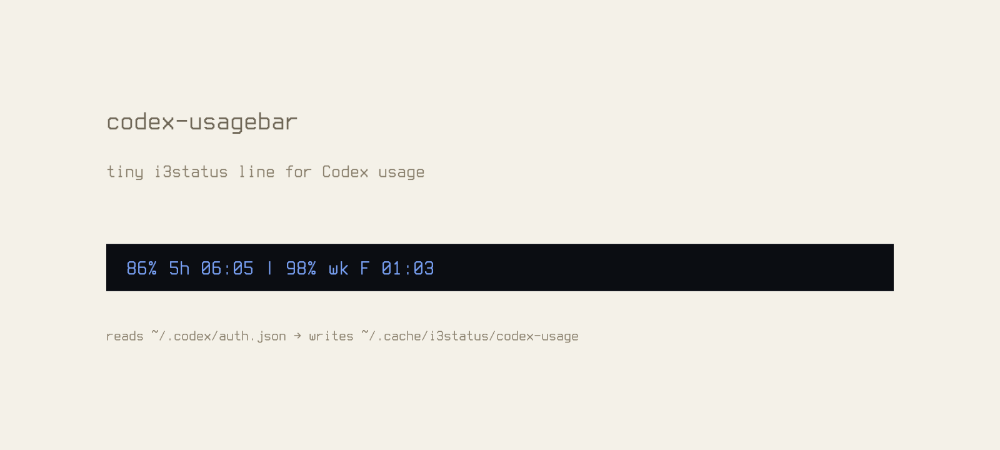

# codex-usagebar

Tiny status widget for showing Codex `/status` usage limits in `i3status`.

[HTML docs](https://jackmhny.github.io/codex-usagebar/README.html)



```text
97% 5h 06:03 | 99% wk F 01:03
```

## About

`codex-usagebar` reads the ChatGPT access token that Codex stores in
`~/.codex/auth.json`, calls the ChatGPT usage endpoint used by Codex status
requests, formats the remaining 5-hour and weekly windows, and atomically writes
the result to:

```text
~/.cache/i3status/codex-usage
```

The token is only used as a bearer token for the request. It is never printed
and never cached.

## Dependencies

- `sh`
- `curl`
- `jq`
- GNU `date`
- `mktemp`

## Install

Copy the script somewhere stable and make it executable:

```sh
install -Dm755 codex-usagebar ~/.local/bin/codex-usagebar
```

Run it once:

```sh
~/.local/bin/codex-usagebar
cat ~/.cache/i3status/codex-usage
```

## Timer

Run it from a systemd user timer. The service is oneshot because the script exits
after each update.

```sh
mkdir -p ~/.config/systemd/user
cat > ~/.config/systemd/user/codex-usagebar.service <<'EOF_SERVICE'
[Unit]
Description=Update Codex usage status for i3status

[Service]
Type=oneshot
ExecStart=%h/.local/bin/codex-usagebar
EOF_SERVICE

cat > ~/.config/systemd/user/codex-usagebar.timer <<'EOF_TIMER'
[Unit]
Description=Refresh Codex usage status for i3status

[Timer]
OnBootSec=30s
OnUnitActiveSec=60s
AccuracySec=10s
Unit=codex-usagebar.service

[Install]
WantedBy=timers.target
EOF_TIMER

systemctl --user daemon-reload
systemctl --user enable --now codex-usagebar.timer
```

## i3status

Use `read_file` and point it at the cache path.

```i3status
order += "read_file codex_usage"

read_file codex_usage {
        path = "~/.cache/i3status/codex-usage"
}
```

## Customize

Edit the constants at the top of `codex-usagebar`.

```sh
auth=${HOME}/.codex/auth.json
out=${HOME}/.cache/i3status/codex-usage
url=https://chatgpt.com/backend-api/wham/usage
icon=''
```

Change the output path, icon, endpoint, labels, or formatting directly in the
file.

## Output format

The normal line is:

```text
97% 5h 06:03 | 99% wk F 01:03
```

That means:

- `97% 5h 06:03`: 97% remains in the primary 5-hour window, resetting today at `06:03`.
- `99% wk F 01:03`: 99% remains in the weekly window, resetting Friday at `01:03`.
- `LIMITED`: appears before the 5-hour percentage if the endpoint reports `limit_reached`.
